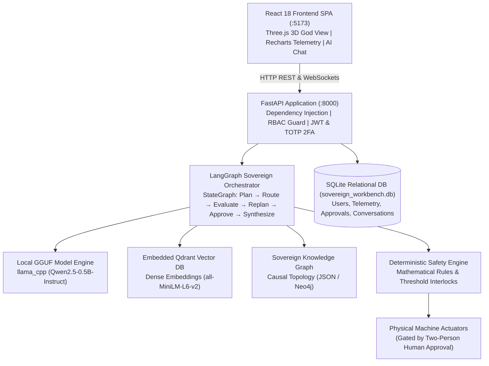

# Sovereign Industrial AI Workbench
### 100% Air-Gapped, Local-First Industrial Operations, Digital Twin Telemetry & Safe Agentic System

[](LICENSE)
[](https://www.python.org/)
[](https://fastapi.tiangolo.com)
[](https://react.dev)
[](https://qdrant.tech)
[](https://langchain-ai.github.io/langgraph/)
[](#)

---

## Overview

The **Sovereign Industrial AI Workbench** is a fully self-contained, air-gapped on-premise AI platform engineered for manufacturing plants, power generation stations, chemical refineries, and critical industrial infrastructure. 

In regulated industrial environments, operational telemetry and proprietary equipment documentation cannot leave the factory boundary. Commercial cloud APIs (OpenAI, Anthropic, AWS) present severe IP leakage, compliance, and availability risks. 

This workbench delivers an **autonomous, private on-premise AI brain** that runs completely on local hardware with **zero cloud dependencies**. It combines real-time multi-sensor digital twins, deterministic mathematical safety interlocks, dense neural document RAG, causal GraphRAG, local GGUF model execution, and a 6-node LangGraph orchestrator protected by a strict two-person approval rule.

---

## What the Project Does

- **Streams Real-Time Telemetry**: Continuously monitors temperature, radial vibration, motor current, and atmospheric gas levels via high-frequency WebSockets.
- **Visualizes Plant in 3D (God View)**: Renders an interactive Three.js WebGL model of the factory floor with live health status color-coding.
- **Enforces Deterministic Safety (Zero LLM)**: Operates mathematical threshold interlocks and emergency stop (E-Stop) sequences that run independently of probabilistic AI to prevent hallucinations.
- **Grounded Industrial Diagnostics**: Answers complex maintenance questions using local SentenceTransformers embeddings (`all-MiniLM-L6-v2`) in embedded Qdrant and causal topological traversal in the Sovereign Knowledge Graph.
- **Two-Person Rule for Actuators**: Suspends autonomous execution when a physical control action is requested, staging a pending signoff queue that requires Safety Officer approval.
- **Air-Gapped Document Ingestion**: Ingests technical manuals and scanned blueprints using local Tesseract OCR with automatic prompt-injection sanitization.
- **Multi-Turn Working & Long-Term Memory**: Retains session dialogue history and cross-session plant failure events across server restarts.

---

## Key Capabilities

| Capability | Purpose | Implementation Reality |
| :--- | :--- | :--- |
| **Live Telemetry WebSockets** | Sub-second sensor updates to browser | Pushes live harmonic physics metrics every 1.5s via `ws://host:8000/ws/telemetry/{id}`. |
| **3D Factory Floor Digital Twin** | Spatial plant health visualization | Interactive Three.js canvas mapping machine bay meshes and dynamic health scores. |
| **Deterministic Safety Engine** | Mathematical trip and shutdown interlocks | Strictly evaluated against mathematical rules; 100% isolated from LLM text generation. |
| **Two-Person Rule Approval Gate**| Human oversight on physical machine commands | Gated by `ApprovalRequest` entity; strictly requires `SAFETY_OFFICER` signoff. |
| **Multi-Turn AI Diagnostic Chat**| Conversational maintenance assistant | SQLite-persisted conversation history injected into prompt context. |
| **Dense Neural Vector RAG** | Proprietary document question answering | In-process embedded Qdrant vector database (`all-MiniLM-L6-v2` dense vectors). |
| **Causal GraphRAG Engine** | Multi-hop root-cause failure analysis | Traverses `HAS_COMPONENT → HAD_FAILURE → GENERATED_INCIDENT → RESOLVED_BY`. |
| **Local GGUF Model Execution** | Zero-cloud neural inference | Runs `qwen2.5-0.5b-instruct-q4_k_m.gguf` via `llama_cpp` on local CPU/GPU. |
| **Hardware-Aware Router** | Dynamic compute resource adaptation | Automatically profiles CPU/RAM/VRAM and routes between local GGUF, sandbox, or fallback. |
| **Dual-Layer Security Shield** | Defense against prompt attacks & data leaks | `PromptGuard` blocks 5 threat categories; `OutputGuard` redacts credentials/keys. |
| **AST-Restricted Python Sandbox**| Safe execution of data analysis scripts | In-memory execution blocking `os`, `sys`, `socket`, `open`, `eval`, `exec`. |
| **Chained HMAC Audit Trail** | Tamper-evident operational logging | Cryptographically chained SHA-256 HMAC logs verified via `/api/audit/verify`. |

---

## Architecture Overview



---

## Technology Stack

- **Backend**: FastAPI 0.115+, Uvicorn, Python 3.11-3.14, SQLAlchemy 2.0.
- **Frontend**: React 18, TypeScript, Vite 6, Tailwind CSS, Three.js, `@react-three/fiber`, Recharts, Zustand, TanStack React Query, Lucide Icons.
- **Databases & Stores**:
  - Primary Relational: SQLite (`sovereign_workbench.db`) / PostgreSQL compatible.
  - Vector Store: Embedded local Qdrant (`qdrant_client`).
  - Graph Store: Sovereign Knowledge Graph (`knowledge_graph.json` / Neo4j Bolt driver).
  - Storage: Local hashed filesystem (`backend/data/documents/`).
- **AI & RAG Runtimes**: Llama-cpp-python (`llama_cpp`), SentenceTransformers (`all-MiniLM-L6-v2`), LangGraph, LangChain, Tesseract OCR (`pytesseract`).
- **Security & Governance**: PBKDF2 hashing, PyJWT, PyOTP (RFC 6238 TOTP), HMAC SHA-256 chained audit logger, Python AST security validator.

---

## Database Overview

The system defines **28 SQLAlchemy ORM models** in `backend/app/models/all_models.py` spanning 7 operational domains:
1. **Authentication & RBAC**: `User`, `Role`, `Permission`, `UserRole`, `RolePermission`, `MFACredential`, `UserSession`.
2. **Digital Twin & Telemetry**: `Asset`, `Machine`, `Component`, `Sensor`, `TelemetryRecord`, `MachineAlert`, `MachineIncident`, `MaintenanceRecord`.
3. **Safety & Approvals**: `SafetyRule`, `SafetyEvent`, `ApprovalRequest`, `ActuatorAudit`.
4. **Document Intelligence & RAG**: `Document`, `DocumentMetadata`, `DocumentChunk`.
5. **Knowledge Graph**: `KnowledgeEntity`, `KnowledgeRelationship`.
6. **Audit & Security**: `AuditLog`, `SecurityEvent`.
7. **Conversation & Working Memory**: `Conversation`, `Message`.

---

## Application Flow

```text
User Message / Diagnostic Query
   ↓
FastAPI Route (`/api/ai/chat`)
   ↓
RBAC Permission Check (`ai:chat`)
   ↓
PromptGuard Security Shield (Catches Injections & Exfiltration)
   ↓
Retrieve Prior Dialogue Turns from SQLite (`Message` table)
   ↓
LangGraph Sovereign Orchestrator
   ├── Node 1: Understand Intent & Structured Task Planning
   ├── Node 2: Route to Sub-Agents (RAG, Telemetry, Vision, Safety, Reasoning)
   ├── Node 3: Evaluate Results & Accumulate Verified Evidence
   ├── Node 4: Dynamic Replanning (if intermediate step failed)
   ├── Node 5: Human Approval Gate (if physical machine action requested)
   └── Node 6: Synthesize Grounded Response with Citations
   ↓
OutputGuard Credential Redaction
   ↓
Persist User & Assistant Turns to SQLite
   ↓
Append Cryptographic HMAC Chained Audit Log
   ↓
Return JSON Response to Frontend
```

---

## Getting Started

### Prerequisites
- Python 3.11+ (Python 3.13 or 3.14 recommended)
- Node.js 18+ and npm

### 1. Start Backend
```bash
cd backend
python3 -m venv venv
source venv/bin/activate
pip install -r requirements.txt
python -m uvicorn app.main:app --host 127.0.0.1 --port 8000 --reload
```

### 2. Start Frontend
In a separate terminal:
```bash
cd frontend
npm install
npm run dev
```
Open your browser at `http://localhost:5173`.

### Default Credentials
| Username | Password | Role |
| :--- | :--- | :--- |
| `admin` | `AdminPass123!` | `ADMINISTRATOR` |
| `engineer` | `EngineerPass123!` | `ENGINEER` |
| `safety` | `SafetyPass123!` | `SAFETY_OFFICER` |
| `operator` | `OperatorPass123!` | `OPERATOR` |

---

## Project Structure

```text
SovereignAIWorkbench/
├── backend/                   # FastAPI backend service
│   ├── app/
│   │   ├── agents/            # LangGraph StateGraph orchestrator & AST sandbox
│   │   ├── ai/                # ModelGateway, inference engine, prompt & output guards
│   │   ├── api/               # 20 REST API router modules
│   │   ├── core/              # Security, RBAC, TOTP MFA, database, audit
│   │   ├── digital_twin/      # Telemetry simulator, asset registry, correlation
│   │   ├── graphrag/          # Knowledge graph causal traversal engine
│   │   ├── hardware/          # Hardware detection & adaptive model router
│   │   ├── models/            # 28 SQLAlchemy ORM models (all_models.py)
│   │   ├── rag/               # SentenceTransformers embeddings, Qdrant store, OCR
│   │   └── safety/            # Deterministic safety engine, rules, approvals
│   ├── data/                  # Embedded Qdrant, knowledge graph, documents
│   ├── models/                # Local GGUF models (qwen2.5-0.5b-instruct)
│   └── tests/                 # 18 Pytest automated test suites
├── frontend/                  # React 18 + Vite dashboard
│   └── src/
│       ├── features/          # 14 industrial dashboard feature views
│       ├── components/        # 3D plant floor (Three.js), charts, layouts
│       └── store/             # Zustand stores (Auth, Alert, Selection)
└── docs/                      # Complete forensic engineering documentation
```

---

## Current Implementation Status

- **Authentication & RBAC**: Fully Implemented (PBKDF2 + JWT + TOTP 2FA + 4 Roles).
- **Digital Twin**: Simulated & Active (Physics-grounded telemetry generator + live WebSockets).
- **Deterministic Safety**: Fully Implemented (Mathematical interlocks + E-Stop).
- **Two-Person Approval**: Fully Implemented (Safety Officer signoff queue).
- **Document Intelligence**: Fully Implemented (Embedded Qdrant + SentenceTransformers + Tesseract OCR).
- **GraphRAG**: Fully Implemented (Causal failure traversal + persistent JSON/Neo4j).
- **Agent Orchestrator**: Fully Implemented (LangGraph StateGraph with 6 nodes & replanning).
- **Local AI Runtimes**: Fully Implemented (GGUF via `llama_cpp` + AST Python Sandbox).
- **Audit Logging**: Fully Implemented (Chained HMAC SHA-256 cryptographic trail).

---

## Documentation

For the complete, forensic, 35-section technical specification including full database field dictionaries, complete API tables, security matrices, and beginner walkthroughs, refer to:

👉 **[docs/COMPLETE_PROJECT_DOCUMENTATION.md](docs/COMPLETE_PROJECT_DOCUMENTATION.md)**

---

## Limitations

- **Telemetry Source**: Sensor telemetry is generated by an internal physics simulator rather than physical PLC fieldbuses (e.g. Modbus/OPC-UA).
- **Model Size**: Bundled with a lightweight 0.5B parameter GGUF model for universal developer laptop compatibility; larger 7B/14B models can be slotted into `backend/models/` on machines with 16GB+ RAM.
- **Air-Gap Enforcement**: Sockets are monitored by software; absolute physical isolation requires hardware router/firewall rules.
